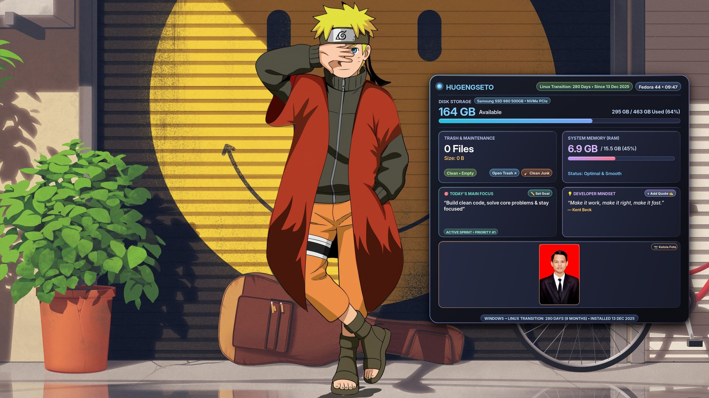

# 🌌 Tokyonight Desktop HUD

<div align="center">


-informational.svg?style=flat-square)


**A sleek, modern, interactive Tokyo Night desktop system HUD & motivation dashboard for Linux.**

<br />



</div>

---

## ✨ Features

- **⚡ Real-Time Hardware & System Overview:**
  - Dynamic SSD model detection (e.g., NVMe PCIe) & available storage progress bar.
  - Live RAM usage monitor with optimal status indicator.
  - Trash can inspector with file count & accurate size calculation.
  - Dynamic Linux uptime and milestone tracker.

- **📸 Motivation Gallery:**
  - Embed up to **2 photos** (graduation, family, personal milestones).
  - **Dynamic Group Centering:** Automatically centers 1 or 2 photos side-by-side.
  - **Automatic EXIF Normalization:** Automatically corrects camera orientation so portrait photos are never rotated sideways.

- **🎯 Productivity & Mindset:**
  - **Today's Main Focus:** Custom sprint goal widget.
  - **Developer Mindset:** Rotating inspirational quotes with quick "Add Quote" dialog.

- **🖱️ Precision Interactive Desktop Layer:**
  - Desktop-integrated clickable buttons (*Open Trash*, *Clean Junk*, *Set Goal*, *Add Quote*, *Manage Photos*).
  - Pixel-perfect hover glow effects and active states.
  - **Multi-Monitor Extend Mode Support:** Automatically calculates scaling and coordinate offsets across heterogeneous dual-monitor setups (e.g., 1080p + 768p).

- **🧹 Built-in Safe System Junk Cleaner:**
  - Safely clears package caches (`dnf`, `apt`, `pip`), stale thumbnail caches, and vacuumed user journal logs without requiring root privileges.

- **🔋 Ultra-Low Resource Consumption:**
  - Powered by Python, Cairo vector graphics, and inotify event-driven architecture.
  - **0% idle CPU usage** and minimal memory footprint.

---

## 🚀 Quick Start & Installation

### Option 1: One-Line Installer (Recommended)

Run this in your terminal to clone and install in seconds:

```bash
git clone https://github.com/hugengseto/tokyonight-hud.git
cd tokyonight-hud
./install.sh
```

The installer automatically:
1. Detects your distribution (`dnf`, `apt`, `pacman`, or `zypper`) and installs required packages (`python3-gobject`, `python3-cairo`, `python3-pillow`, `trash-cli`).
2. Copies executable binaries, assets, and desktop application shortcuts.
3. Automatically uses your current desktop wallpaper as the background canvas.
4. Registers and starts the user background daemon via `systemd`.

---

## 🖥️ CLI & Usage

You can control Tokyonight HUD directly from terminal or your desktop Application Menu:

| Command | Action |
| :--- | :--- |
| `tokyonight-hud settings` | Open the unified **Control Center GUI** (Title, Photos, Goal, Maintenance) |
| `tokyonight-hud photo` | Open the Motivation Photo Manager dialog |
| `tokyonight-hud goal` | Set your daily sprint priority / focus |
| `tokyonight-hud quote` | Add a new developer mindset quote |
| `tokyonight-hud clean` | Run the safe system junk & cache cleaner |
| `tokyonight-hud reload` | Force immediate wallpaper & overlay refresh |
| `tokyonight-hud status` | Check service status and resource consumption |
| `tokyonight-hud restart` | Restart background service |
| `tokyonight-hud logs` | Stream live service logs |

---

## ⚙️ Configuration Files

All user data is stored cleanly inside `~/.config/tokyonight-hud/` adhering to the XDG standard:

- `hud_title.txt` — The main header title displayed on the HUD card.
- `hud_footer.txt` — Custom bottom milestone badge text.
- `motivation_photos.json` — Photo slot paths and metadata.
- `daily_goal.json` — Active daily sprint focus.
- `quotes.json` — Custom quotes list.
- `wallpaper_base.jpg` — The base wallpaper image before HUD compositing.

---

## 🗑️ Uninstallation

To cleanly remove Tokyonight HUD from your system at any time:

```bash
cd tokyonight-hud
./uninstall.sh
```

---

## 🤝 Contributing

Contributions, issues, and feature requests are welcome!
Feel free to check the [issues page](https://github.com/hugengseto/tokyonight-hud/issues).

---

## 📄 License

This project is licensed under the [MIT License](LICENSE).
Created with ❤️ by [Hugeng Seto](https://github.com/hugengseto).
